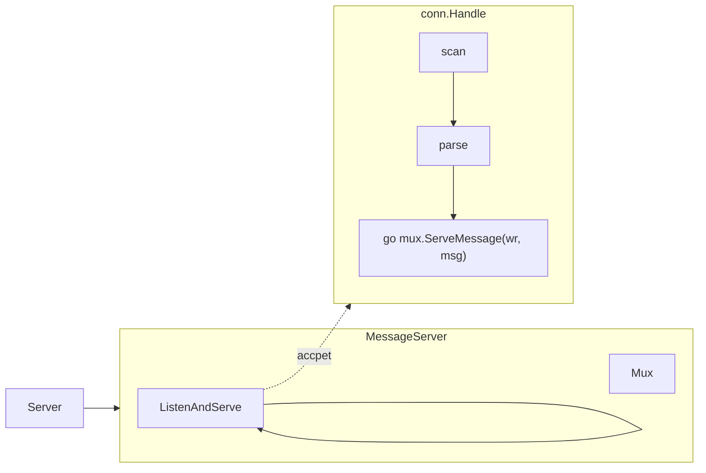

# Overview

This document tries to detail the current thinking / design behind fossil. Most sections are WIP and are most likely
unimplemented and still in the design phase.

- [Overview](#overview)
	- [Architecture](#architecture)
		- [Database](#database)
		- [Server](#server)
			- [Fire and Forget](#fire-and-forget)
			- [Active](#active)
			- [Design](#design)
				- [Message Mux](#message-mux)
				- [Server Structure](#server-structure)
				- [Server Startup](#server-startup)
			- [Client Connections and Databases](#client-connections-and-databases)
	- [Data Types (WIP)](#data-types-wip)
		- [Schema Syntax (WIP)](#schema-syntax-wip)
	- [Queries (WIP)](#queries-wip)

Additional Documentation
- [Grammar](./grammar.md)
- [Protocol](./protocol.md)
- [Deployment](./deployment.md)


## Architecture

### Database

A fossil database essentially behaves as an unbounded array. It is divided up into *segments*, each of which is of a 
fixed width and is made up of *datum*. Because Fossil is a time-series database, all datum are ordered sequentially. 
For this reason, timestamps are only recorded in each segment data structure, and each datum only stores an offset in 
nanoseconds from the segment timestamp.

This means that the overhead for storing data in fossil is quite low, which is useful depending on what kind of data is 
being stored in the database.

In addition to the time and data that is being stored in each segment, datum can belong to a particular *topic*. The 
topic is the primary way of indexing into the data (besides time, of course). Because a topic id is stored in each 
datum, it is trivial to filter on a particular topic, or group of topics.

### Server

Fossil server uses a TCP socket to listen for client connections. Clients can act in two modes: 
- **Fire and Forget** for data collection
- **Active** for data collection and querying

#### Fire and Forget
Clients in Fire and Forget mode connected to the server are limited to write only commands from the command list to ensure performant writes.

#### Active
Clients connected in active mode are open to use all commands, read and write, on the database.

#### Design

Attempting to not reinvent the wheel usage of the net/http patterns help create a familiar pattern that can be easily used and expanded on. The following diagram is a simple representation of the Server, Mux, and handler pattern. The Application Server creates a MessageServer, and MessageMux and uses the MessageMux to register handler functions for a given message type. The MessageServer handles connections by spinning up a connection handler to parse the wire messages and then handing that message off to the correct message handler via the Mux.



##### Message Mux
Attempting to find the middle ground between an easy to use and expand solution and a performant solution three different mux types were tested and benchmarked. Slice, Map, and Switch based Muxes were tested using a benchmark with the following results.

```shell
❯ go test -benchmem -benchtime=5s -v -bench=.
goos: darwin
goarch: arm64
pkg: github.com/dburkart/fossil/pkg/server
BenchmarkSliceCommandParse
BenchmarkSliceCommandParse-10     	1000000000	         5.807 ns/op	       0 B/op	       0 allocs/op
BenchmarkSwitchCommandParse
BenchmarkSwitchCommandParse-10    	1000000000	         4.578 ns/op	       0 B/op	       0 allocs/op
BenchmarkMapCommandParse
BenchmarkMapCommandParse-10       	603785710	         9.879 ns/op	       0 B/op	       0 allocs/op
PASS
ok  	github.com/dburkart/fossil/pkg/server	19.132s
```

With the above results in mind we went with the MapBased mux for now in-order to allow for quick changes and low memory usage at the minor cost of some CPU performance.

##### Server Structure
Fossil server can be run with many logical databases being served from a single physical server instance. When connecting to the server you may include a database in the connection string selecting the logical database you wish to connect to for operations.

##### Server Startup
For each `database` config block, a logical database item is created and added to the map of databases available on the server. 

#### Client Connections and Databases
When a request hits the server the client sets the database it is working with as the initial request which is set on each subsequent message for processing in the handlers. The database defaults to `default` if there is no database negotiated.

## Schema and Data Types

See [schema documentation](./schema.md).

## Queries

See [query grammar](./grammar.md).